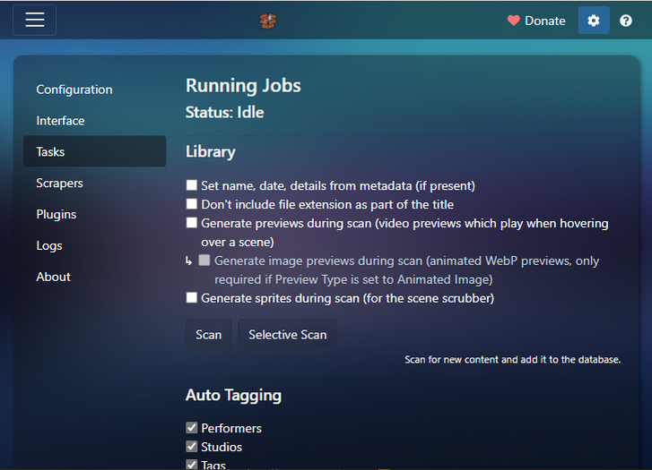
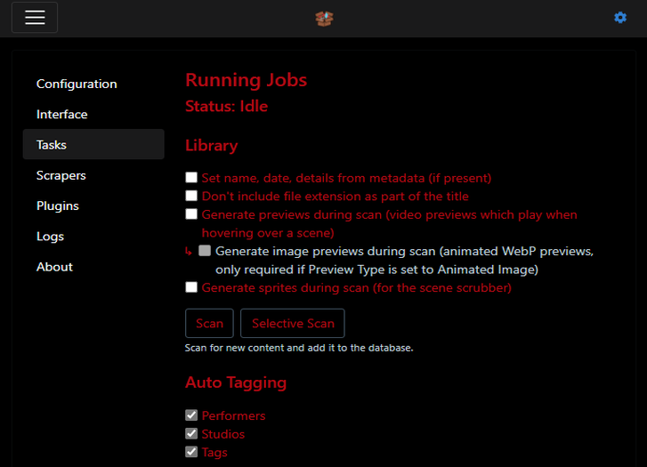
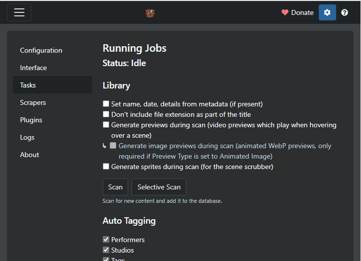

# Overview
Stash supports Custom CSS themes to adjust the look-and-feel of the interface. There are several that have been created by the maintainers and users.  

## Installing themes
To Install a theme

1. Select a theme from the directory below, and copy the CSS code to your clipboard. You may also need to download image files, as per the instructions.
2. In Stash, go to the Config section, then select "Interface"
3. Make sure "Custom CSS" is checked, then paste the CSS code into the text box.
4. You will need to force-reload (Shift+F5) in order to see the theme.

## Creating themes
If you would like to develop your own theme, we have a [reference guide of CSS snippets that may be useful.](../css-snippets.md)

## Available themes

| Name | Preview |
|:---:|:---:|
| [Pulsar](theme-pulsar.md) |  |
| [Night](theme-night.md) |  |
| [Plex](theme-plex.md) |  |

